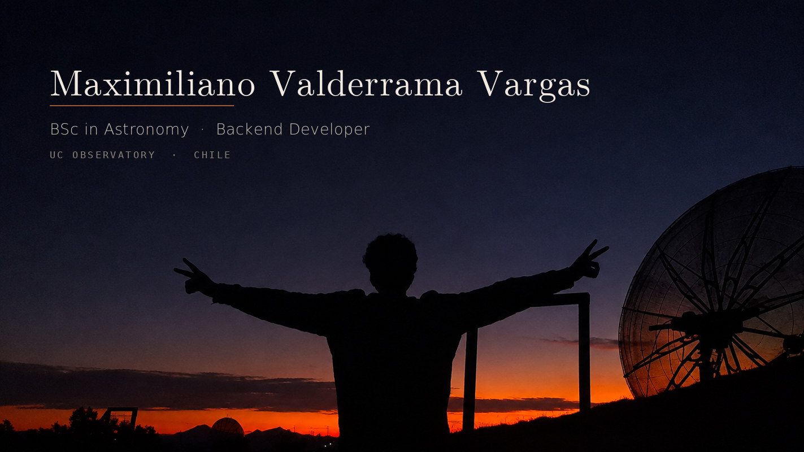

  
 
    

BSc in Astronomy (PUC Chile, 2026), self-taught backend developer. Heading toward software engineering and quantitative finance.

I write code to look at things: protoplanetary disks, geodesics in Schwarzschild metrics, integral-field data cubes. Now I point the same habit at building product.

Building

  DecoIA — AI interior design SaaS, zero to production. Photograph a room, get coherent furniture recommendations with real products. Django · React · Supabase.

  Asterion — RAG research agent over ADS, SIMBAD, Gaia, VizieR and the NASA Exoplanet Archive. Hybrid search with pgvector across 47,000 papers, 35 tools, 400+ tests. Python · LangChain · FastAPI.

Astrophysics

  PA3Py — pebble accretion in protoplanetary disks.

  neural-geodesics — neural network for relativistic ray tracing around black holes.

  photonic-inverse-design — gradient-based optimization over Maxwell with CNN reparametrization.

  Simulacion-lente-gravitacional — gravitational lensing simulation, SIS model with external shear.

Python · Django · FastAPI · PostgreSQL · pgvector · PyTorch · React · Next.js
